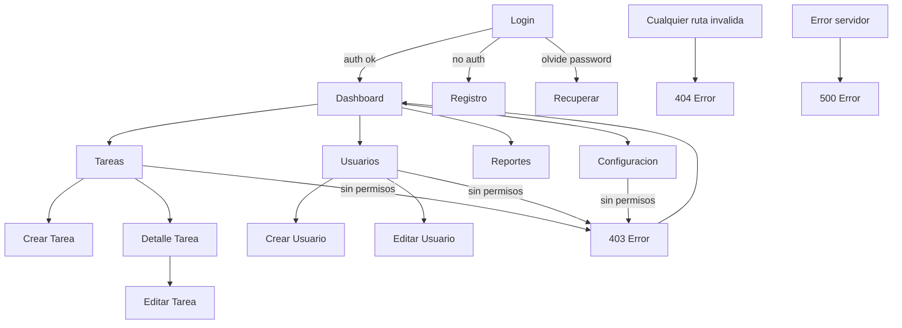

# Arbol de Rutas - TaskManager

## Rutas Publicas (sin autenticacion)
```
/login                  -> LoginPage
/register               -> RegisterPage
/forgot-password        -> ForgotPasswordPage
/404                    -> NotFoundPage
/500                    -> ServerErrorPage
```

## Rutas Protegidas (requieren autenticacion)

### Admin (acceso total)
```
/dashboard              -> DashboardPage
/tasks                  -> TaskListPage
/tasks/create           -> TaskCreatePage
/tasks/:id              -> TaskDetailPage
/tasks/:id/edit         -> TaskEditPage
/users                  -> UserListPage
/users/create           -> UserCreatePage
/users/:id/edit         -> UserEditPage
/reports                -> ReportsPage
/settings               -> SettingsPage
```

### Manager (equipo)
```
/dashboard              -> DashboardPage
/tasks                  -> TaskListPage (filtrado por equipo)
/tasks/create           -> TaskCreatePage
/tasks/:id              -> TaskDetailPage (solo equipo)
/tasks/:id/edit         -> TaskEditPage (solo equipo)
/users                  -> UserListPage (solo lectura)
/reports                -> ReportsPage (solo lectura)
```

### User (solo tareas propias)
```
/dashboard              -> DashboardPage (solo sus metricas)
/tasks                  -> TaskListPage (filtrado por assigned_to = userId)
/tasks/:id              -> TaskDetailPage (solo si es su tarea)
```

## Diagrama de Navegacion



## Route Guards

| Ruta | Guard | Redireccion si falla |
|------|-------|---------------------|
| /dashboard | isAuthenticated | /login |
| /tasks | isAuthenticated | /login |
| /tasks/create | roleIn([admin, manager]) | /403 |
| /tasks/:id/edit | roleIn([admin, manager]) + ownsTask | /403 |
| /users/* | roleIn([admin]) | /403 |
| /reports | roleIn([admin, manager]) | /403 |
| /settings | roleIn([admin]) | /403 |
