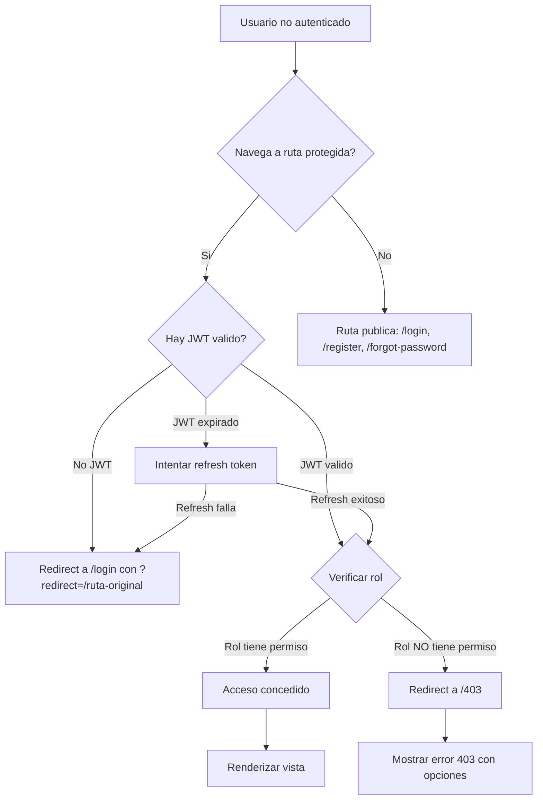

# Flujo de Autenticacion y Permisos - TaskManager

## Diagrama General de Autenticacion



## Route Guards por Tipo de Ruta

### Ruta Publica
```typescript
// Si el usuario ya esta autenticado, redirigir a /dashboard
// Si no, mostrar la ruta publica
function publicGuard(route) {
    if (isAuthenticated()) {
        return redirect('/dashboard');
    }
    return route;
}
```

### Ruta Protegida (cualquier rol autenticado)
```typescript
// Si no esta autenticado, redirigir a /login
// Si esta autenticado, permitir acceso
function protectedGuard(route) {
    if (!isAuthenticated()) {
        return redirect('/login?redirect=' + route.path);
    }
    return route;
}
```

### Ruta por Rol
```typescript
// Verificar que el usuario tenga el rol requerido
function roleGuard(route, allowedRoles: string[]) {
    if (!isAuthenticated()) {
        return redirect('/login?redirect=' + route.path);
    }
    
    const user = getCurrentUser();
    if (!allowedRoles.includes(user.role)) {
        return redirect('/403');
    }
    return route;
}
```

## Comportamiento del Sidebar por Rol

### Admin
- Ve TODAS las opciones del sidebar
- Dashboard, Tareas, Usuarios, Reportes, Configuracion

### Manager
- Ve Dashboard, Tareas (solo las de su equipo), Usuarios (solo lectura)
- NO ve: Reportes, Configuracion, Usuarios (no create/edit/delete)
- NO ve botones: Eliminar

### User
- Ve Dashboard, Tareas (solo las propias)
- NO ve: Usuarios, Reportes, Configuracion
- NO ve botones: Crear, Editar, Eliminar

## Manejo de Sesion

### Tokens
- Access Token: JWT, 15 minutos de expiracion
- Refresh Token: JWT, 7 dias de expiracion
- Almacenamiento: httpOnly cookies (recomendado) o localStorage

### Logout
1. Usuario click "Cerrar Sesion"
2. Eliminar tokens del cliente
3. Limpiar cache/estado de la app
4. Redirect a /login
5. Opcional: llamar a POST /api/auth/logout para invalidar refresh token

### Protecciones Adicionales
- Rate limiting: 5 intentos de login por minuto por IP
- Bloqueo de cuenta: 15 minutos tras 5 intentos fallidos
- CAPTCHA: requerido tras 3 intentos fallidos
- Sesion expirada: redirect automatico a /login
- Inactividad: warning a los 30 min, logout a los 60 min

## Vistas de Error por Escenario

| Escenario | Codigo | Vista | Accion |
|-----------|--------|-------|--------|
| No autenticado | 401 | /login | Iniciar sesion |
| Sin permisos | 403 | /403 | Solicitar acceso |
| Recurso no existe | 404 | /404 | Ir a inicio |
| Error de servidor | 500 | /500 | Reintentar |
| Token expirado | 401 | /login (auto) | Refrescar/iniciar sesion |
| Cuenta bloqueada | 423 | /login (mensaje) | Esperar o contactar soporte |
