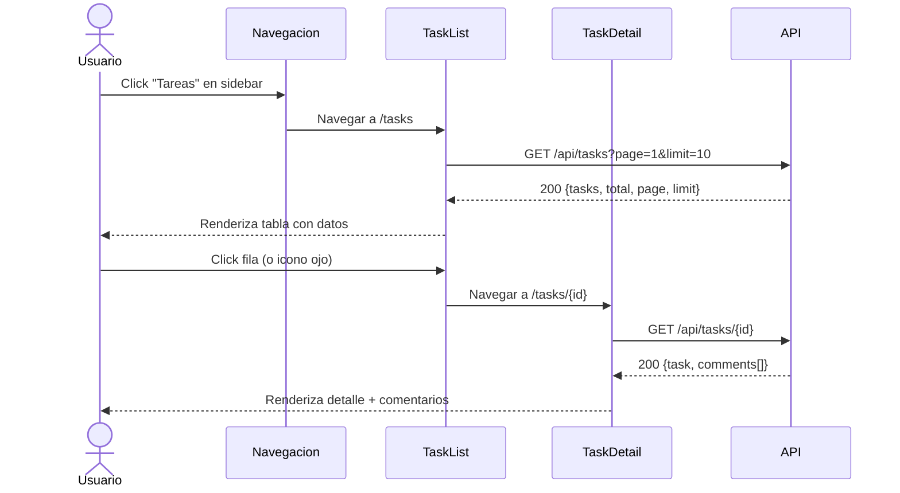
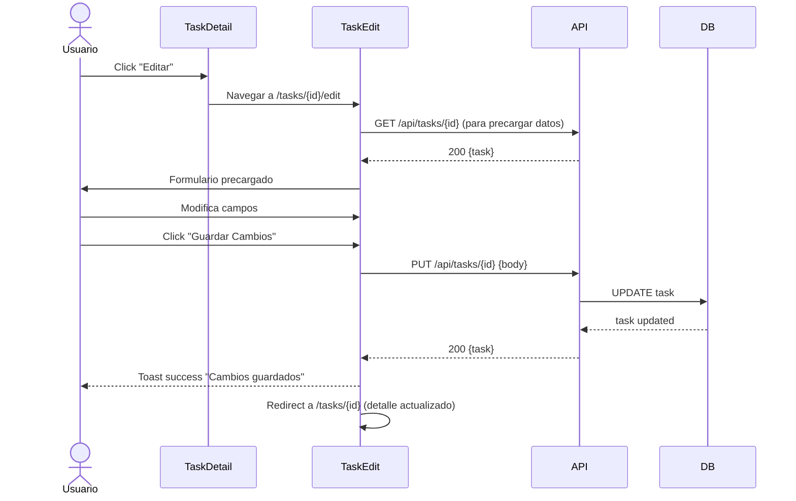
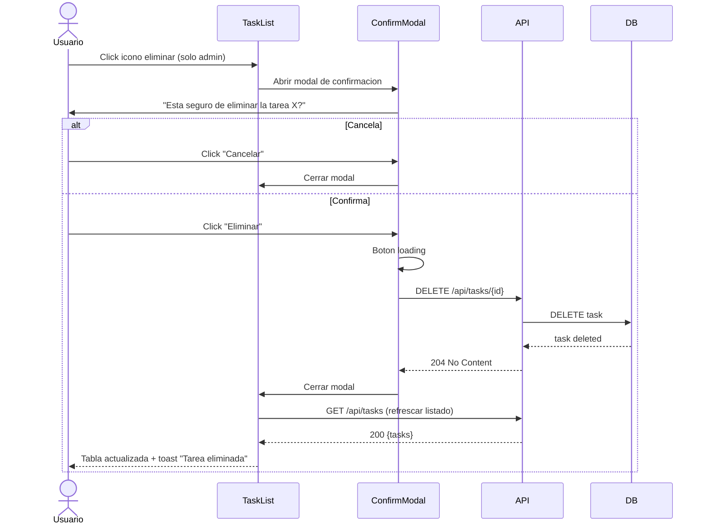

# Flujo CRUD de Tareas - TaskManager

## CREATE: Crear Tarea

```mermaid
sequenceDiagram
    actor User as Usuario
    participant List as TaskList
    participant Create as TaskCreate
    participant API as API
    participant DB as DB

    User->>List: Click "+ Crear Tarea"
    List->>Create: Navegar a /tasks/create
    Create->>User: Muestra formulario vacio
    User->>Create: Llena campos (titulo, descripcion, prioridad, asignado)
    Create->>Create: Validacion cliente
    alt Campos invalidos
        Create-->>User: Errores inline
    else Campos validos
        User->>Create: Click "Guardar"
        Create->>Create: Boton loading
        Create->>API: POST /api/tasks {body}
        API->>DB: INSERT task
        DB-->>API: task created
        API-->>Create: 201 {task}
        Create-->>User: Toast success "Tarea creada exitosamente"
        Create->>Create: Redirect a /tasks (o /tasks/{id} para ver detalle)
    end
```

## READ: Ver Listado y Detalle



## UPDATE: Editar Tarea



## DELETE: Eliminar Tarea



## Flujo de Autorizacion por Operacion

| Operacion | Admin | Manager | User |
|-----------|-------|---------|------|
| Crear | Si | Si (solo su equipo) | No |
| Ver listado | Si | Si | Si (solo propias) |
| Ver detalle | Si | Si | Si (solo propias) |
| Editar | Si | Si (solo su equipo) | No |
| Eliminar | Si | No | No |
