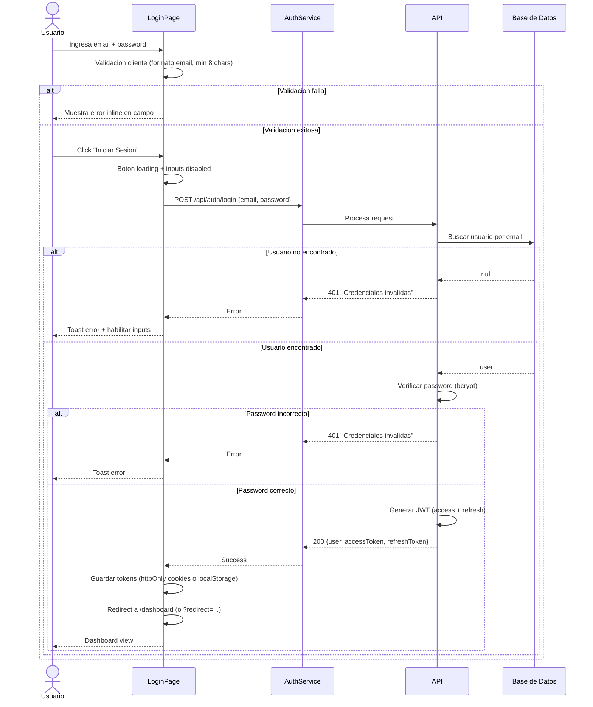
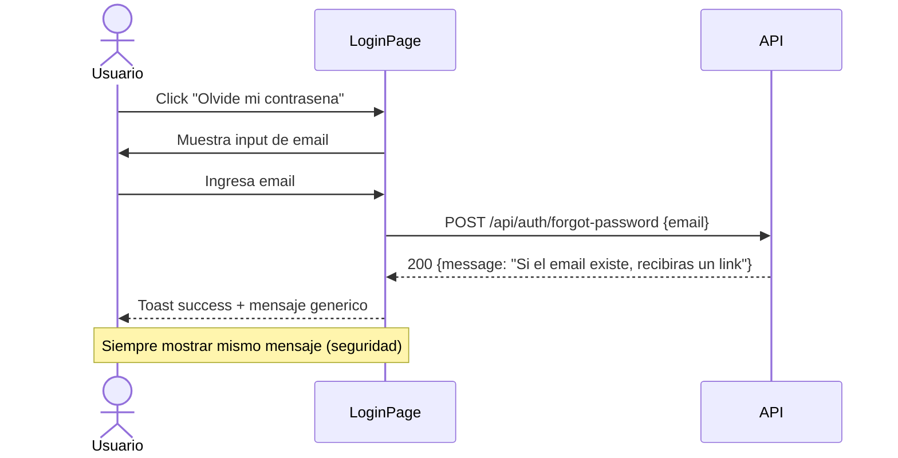

# Flujo de Login - TaskManager

## Flujo Alternativo: Olvide mi Password

## Reglas de UI

1. **Formulario centrado** en layout minimal (sin sidebar)
2. **Logo** arriba del formulario
3. **Link "Olvide mi password"** abajo del campo password
4. **Link "Registrarse"** abajo del boton submit
5. **Redirect automatico** si el usuario ya esta autenticado
6. **Proteccion contra fuerza bruta**: bloqueo de cuenta tras 5 intentos fallidos
7. **CAPTCHA** despues de 3 intentos fallidos
8. **Mensaje de error generico**: nunca revelar si el email existe o no
