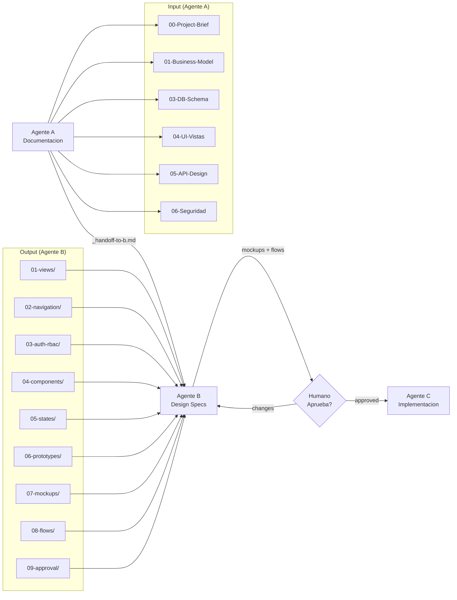

# Agente B — Design Documentation Agent

## Descripcion

Sistema de **Agente B** que toma la documentacion generada por el **Agente A** (agents-doc)
y produce **especificaciones tecnicas detalladas de UI/UX** (sin generar codigo), y genera
un **prompt de activacion** para que un **Agente C** implemente todo el proyecto.

---

## Flujo Completo: Agente A -> B -> C

```
AGENTE A (Documentacion Previa)
  Crea:   agents-doc/agents-doc/05-proyectos/<proyecto>/
  Docs:   Business Model, DB Schema, UI Wireframes, API, NFR, Roadmap
  Handoff: _handoff-to-b.md  (contiene la ruta del proyecto)
       |
       |  (el usuario pasa la ruta de la carpeta al Agente B)
       v
AGENTE B (Design Documentation)  <<< ESTE SISTEMA
  Lee:    agents-doc/agents-doc/05-proyectos/<proyecto>/
          (documentos del Agente A)
  Crea:   agents-doc/agents-design/01-proyectos/<proyecto>/
          - 01-views/        (vistas con componentes y estados)
          - 02-navigation/   (routing, sidebar, breadcrumbs)
          - 03-auth-rbac/    (roles, permisos, route guards)
          - 04-components/   (botones, formularios, tablas, modales)
          - 05-states/       (loading, empty, error, success)
          - 06-prototypes/   (flujos de usuario)
  Handoff: _handoff-to-c.md  (prompt auto-contenido para Agente C)
       |
       |  (el usuario pasa el _handoff-to-c.md al Agente C)
       v
AGENTE C (Implementation)
  Lee:    agents-doc/agents-design/01-proyectos/<proyecto>/_handoff-to-c.md
  Crea:   <directorio-destino>/  (proyecto de software completo)
          - src/, tests/, configuracion, CI/CD, Docker
```

---

## Estructura de Carpetas

```
agents-doc/
|
+-- agents-doc/                        <-- Sistema Agente A (existente)
|   |-- 00-metodologia-core/
|   |-- 01-plantillas/
|   |-- 03-roles-agentes/
|   +-- 05-proyectos/                  <-- Input: docs de proyectos
|
+-- agents-design/                     <-- ESTE SISTEMA (Agente B)
    |-- README.md
    |-- _config/
    |   |-- agente-b-prompt.md          <-- Prompt maestro del Agente B
    |   |-- agente-a-input.schema.json  <-- Schema del input (desde Agente A)
    |   +-- agente-b-output.schema.json <-- Schema del output (hacia Agente C)
    |
    |-- templates/                      <-- Plantillas para generar outputs
    |   |-- view-template.md
    |   |-- auth-matrix-template.yml
    |   |-- component-template.yml
    |   |-- error-view-template.md
    |   |-- mockup-template.html          <-- Mockup HTML autonomo (CSS inline)
    |   |-- flow-template.md              <-- Flujo de usuario con Mermaid
    |   |-- user-journey-map-template.md  <-- Mapa de viaje por rol
    |   |-- approval-checklist-template.md <-- Checklist de revision de diseno
    |   |-- tdd-strategy-template.md      <-- Estrategia TDD para Agente C
    |   |-- test-rbac-template.md         <-- Tests RBAC por endpoint
    |   |-- test-component-template.md    <-- Tests de componentes UI
    |   |-- test-e2e-template.md          <-- Tests E2E con Playwright
    |   +-- handoff-to-c-template.md      <-- Handoff (solo tras aprobacion)
    |
    |-- examples/                       <-- Ejemplos de referencia
    |   +-- taskmanager/                <-- Ejemplo: TaskManager
    |       |-- _index.json
    |       |-- _handoff-to-c.md
    |       |-- 01-views/               (6 vistas: login, dashboard, tasks-list, 403, 404, 500)
    |       |-- 02-navigation/          (routing-tree.md)
    |       |-- 03-auth-rbac/           (permissions-matrix.yml)
    |       |-- 04-components/          (componentes UI definidos)
    |       |-- 05-states/              (estados por vista)
    |       |-- 06-prototypes/          (flujos de usuario basicos)
    |       |-- 07-mockups/             (mockups HTML + galeria _index.html)
    |       |-- 08-flows/               (flujos completos: auth, crud, journey)
    |       +-- 09-approval/            (checklist + approval-status.json)
    |
    +-- 01-proyectos/                   <-- Destino de outputs futuros
        +-- .gitkeep
```

---

## Como Usar

### Paso 1: El usuario ejecuta el Agente A
El Agente A genera la documentacion del proyecto en:
`agents-doc/agents-doc/05-proyectos/<proyecto>/`
y crea un archivo `_handoff-to-b.md` con la ruta.

### Paso 2: El usuario ejecuta el Agente B
Invocar al Agente B con el prompt maestro:
```
Usa el prompt en: agents-doc/agents-design/_config/agente-b-prompt.md

La carpeta del proyecto esta en:
agents-doc/agents-doc/05-proyectos/<proyecto>/
```

El Agente B:
1. Lee todos los documentos del proyecto
2. Genera las especificaciones UI/UX en `agents-doc/agents-design/01-proyectos/<proyecto>/`
3. Genera el archivo `_handoff-to-c.md` con el prompt para el Agente C

### Paso 3: El usuario ejecuta el Agente C
Invocar al Agente C con el prompt generado:
```
Usa el prompt en:
agents-doc/agents-design/01-proyectos/<proyecto>/_handoff-to-c.md

Crea el proyecto en: <ruta-donde-crear-el-proyecto>/
```

---

## Reglas del Agente B

1. **No generar codigo** — Solo documentacion tecnica
2. **No generar nada sin orden** — Solo cuando el usuario lo solicite explicitamente
3. **Toda vista debe incluir:** auth (requerido/opcional, roles), acciones (botones, navegacion), estados (loading, empty, error, success)
4. **Usar formatos:** Markdown + Frontmatter YAML para vistas, YAML para datos estructurados, Mermaid para diagramas
5. **Vistas de error obligatorias:** 403 (Forbidden), 404 (Not Found), 500 (Server Error)
6. **RBAC completo:** Matriz Rol x Vista x Accion con redirects explicitos para acceso denegado
7. **Handoff auto-contenido:** El `_handoff-to-c.md` debe contener TODO lo que el Agente C necesita, sin depender de los docs originales

---

## Idiomas

- Documentacion del Agente B: Espanol
- Schemas JSON: Espanol (nombres de propiedades)
- Templates: Espanol (con headers en Espanol)
- Codigo en ejemplos: Espanol

---

## Guia Paso a Paso: Flujo A -> B -> C

### Fase 1: Agente A genera la documentacion del proyecto

```bash
# 1. El Agente A crea la carpeta del proyecto en:
#    agents-doc/agents-doc/05-proyectos/<proyecto>/
#
# 2. Genera estos archivos (obligatorios):
#    - 00-Project-Brief-Consolidado.md
#    - 01-Business-Model-y-Requerimientos.md
#    - 03-Esquema-Base-de-Datos.md
#    - 04-UI-Vistas-y-Flujos-de-Usuario.md
#    - 05-API-Design.md
#    - 06-Seguridad-y-NFR.md
#
# 3. Genera estos archivos (opcionales):
#    - 02-ADR-Arquitectura.md
#    - 07-Roadmap-y-Riesgos.md
#
# 4. Crea _handoff-to-b.md con la ruta del proyecto
```

**Template de handoff:** `templates/handoff-to-b-template.md`

**Validar antes de pasar a B:**
```bash
# Script Bash (simple)
bash scripts/validate-agente-a-input.sh <ruta-del-proyecto>

# Script Node.js (avanzado — valida YAML y schema JSON)
cd scripts && node validate-agente-a.mjs <ruta-del-proyecto>
```

---

### Fase 2: Agente B genera las especificaciones UI/UX

```bash
# 1. Invocar al Agente B con este prompt:
#    "Usa el prompt en: agents-doc/agents-design/_config/agente-b-prompt.md
#     La carpeta del proyecto esta en: agents-doc/agents-doc/05-proyectos/<proyecto>/"
#
# 2. El Agente B lee los documentos y genera:
#    agents-doc/agents-design/01-proyectos/<proyecto>/
#    |-- 01-views/         (6+ vistas con componentes y estados)
#    |-- 02-navigation/    (arbol de rutas, sidebar, breadcrumbs)
#    |-- 03-auth-rbac/     (roles, permisos, route guards)
#    |-- 04-components/    (catalogo de componentes UI)
#    |-- 05-states/        (loading, empty, error, success)
#    |-- 06-prototypes/    (flujos de usuario con diagramas)
#    +-- _handoff-to-c.md  (prompt auto-contenido para Agente C)
#
# 3. Opcional: Comparar con el ejemplo de referencia:
#    examples/taskmanager/
```

---

### Fase 3: Agente C implementa el proyecto completo

```bash
# 1. Invocar al Agente C con el prompt generado:
#    "Usa el prompt en:
#     agents-doc/agents-design/01-proyectos/<proyecto>/_handoff-to-c.md
#     Crea el proyecto en: <ruta-donde-crear-el-proyecto>/"
#
# 2. El Agente C crea el proyecto de software completo:
#    - Frontend (React, Vue, etc.)
#    - Backend (Node.js, Python, etc.)
#    - Base de datos (esquemas, migraciones)
#    - Autenticacion y autorizacion
#    - Tests, CI/CD, Docker
```

---

## Scripts de Validacion

### `scripts/validate-agente-a-input.sh`
Script Bash que verifica que un proyecto del Agente A tenga los archivos
requeridos antes de pasarlo al Agente B.

```bash
bash scripts/validate-agente-a-input.sh <ruta-del-proyecto>
```

### `scripts/validate-agente-a.mjs`
Script Node.js avanzado que ademas de verificar archivos:
- Valida el frontmatter YAML de cada documento
- Valida contra el schema JSON oficial (`_config/agente-a-input.schema.json`)
- Da output con colores y resumen numerico

```bash
cd scripts && node validate-agente-a.mjs <ruta-del-proyecto>
```

---

## Archivos Clave (Resumen)

| Archivo | Proposito |
|---------|-----------|
| `_config/agente-b-prompt.md` | Prompt maestro para invocar al Agente B |
| `_config/agente-a-input.schema.json` | Schema JSON que valida el input del Agente A |
| `_config/agente-b-output.schema.json` | Schema JSON que valida el output del Agente B |
| `templates/handoff-to-b-template.md` | Template para que A genere el handoff hacia B |
| `templates/handoff-to-c-template.md` | Template para que B genere el handoff hacia C (solo tras aprobacion) |
| `templates/view-template.md` | Plantilla para documentar vistas/pantallas |
| `templates/component-template.yml` | Plantilla para documentar componentes UI |
| `templates/auth-matrix-template.yml` | Plantilla para matriz de permisos RBAC |
| `templates/error-view-template.md` | Plantilla para vistas de error (403/404/500) |
| `templates/mockup-template.html` | Plantilla para mockups HTML autonomos (CSS inline) |
| `templates/flow-template.md` | Plantilla para flujos de usuario con Mermaid |
| `templates/user-journey-map-template.md` | Plantilla para mapa de viaje por rol |
| `templates/approval-checklist-template.md` | Plantilla para el checklist de revision de diseno |
| `templates/tdd-strategy-template.md` | Estrategia TDD para incluir en el handoff a C |
| `templates/test-rbac-template.md` | Plantilla de tests RBAC por endpoint |
| `templates/test-component-template.md` | Plantilla de tests de componentes UI |
| `templates/test-e2e-template.md` | Plantilla de tests E2E con Playwright |
| `scripts/validate-agente-a-input.sh` | Script Bash de validacion |
| `scripts/validate-agente-a.mjs` | Script Node.js de validacion con schema |
| `examples/taskmanager/` | Ejemplo completo de referencia |
| `01-proyectos/taskmanager/` | Proyecto simulado (output de B) |
| `01-proyectos/taskmanager/_handoff-to-b.md` | Simulacion de handoff A -> B |

---

## Resumen Visual del Flujo



