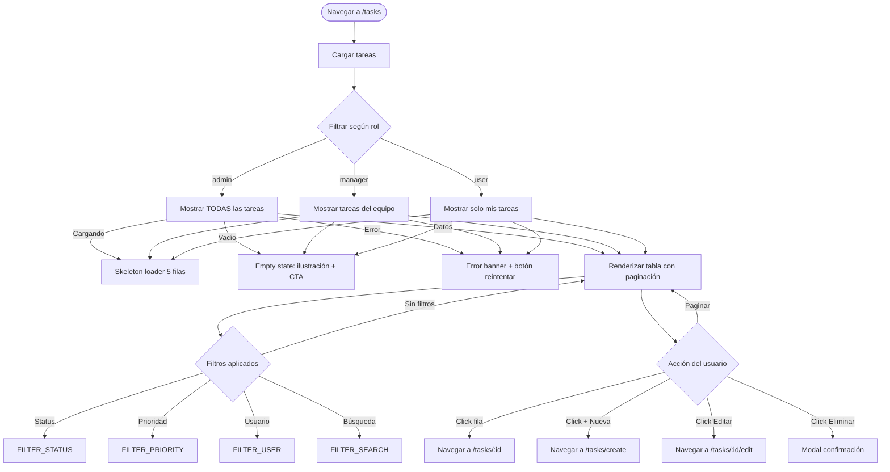

# Flujo: CRUD de Tareas

## Descripción
Flujo completo de gestión de tareas: listar, crear, ver detalle, editar y eliminar. Cada operación varía según el rol del usuario.

## User Stories Relacionadas
| ID | Historia |
|----|----------|
| US-003 | Como usuario quiero crear tareas para organizar mi trabajo |
| US-004 | Como manager quiero asignar tareas a mi equipo |
| US-005 | Como admin quiero gestionar todas las tareas del sistema |

---

## Diagrama de Flujo — Listado



## Diagrama de Flujo — Crear/Editar

```mermaid
flowchart TD
  START_FORM([Abrir formulario]) --> CHECK_ROLE{Usuario puede crear/editar?}

  CHECK_ROLE -->|No| REDIRECT_403[Redirect 403]
  CHECK_ROLE -->|Sí| RENDER_FORM[Renderizar formulario]

  RENDER_FORM -->|Editar| PREFILL[Precargar datos existentes GET /api/tasks/:id]
  RENDER_FORM -->|Crear| EMPTY_FORM[Formulario vacío]

  PREFILL -->|Cargando| SKELETON_FORM[Skeleton form]
  PREFILL -->|Error| SHOW_ERR[Mostrar error + botón reintentar]
  PREFILL -->|Datos| FILLED[Campos precargados]

  FILLED --> SUBMIT{Usuario guarda}
  EMPTY_FORM --> SUBMIT

  SUBMIT --> VALIDATE_CLIENT[Validar campos en cliente]
  VALIDATE_CLIENT -->|Inválido| INLINE_ERR[Mostrar errores inline por campo]
  INLINE_ERR --> SUBMIT

  VALIDATE_CLIENT -->|Válido| SAVE_BTN[Botón loading + "Guardando..."]
  SAVE_BTN --> API_CALL{Llamada API}

  API_CALL -->|Crear| POST[POST /api/tasks]
  API_CALL -->|Editar| PUT[PUT /api/tasks/:id]

  POST -->|201| TOAST_SUCCESS[Toast: "Tarea creada exitosamente"]
  POST -->|400| VALIDATION_ERR[Mostrar errores del servidor]
  POST -->|403| FORBIDDEN[Modal: "No tienes permisos"]
  POST -->|500| SERVER_ERR[Toast error: "Error al guardar"]

  PUT -->|200| TOAST_SUCCESS
  PUT -->|400| VALIDATION_ERR
  PUT -->|403| FORBIDDEN
  PUT -->|404| NOT_FOUND[Toast: "Tarea no encontrada"]
  PUT -->|500| SERVER_ERR

  TOAST_SUCCESS --> REDIRECT_LIST[Redirect a /tasks]
  VALIDATION_ERR --> SUBMIT
  FORBIDDEN --> REDIRECT_403
  SERVER_ERR --> SUBMIT
```

## Diagrama de Flujo — Eliminar

```mermaid
flowchart TD
  CLICK_DELETE[Click icono eliminar] --> CHECK_DEL_ROLE{Usuario puede eliminar?}

  CHECK_DEL_ROLE -->|No, solo admin| HIDE_DELETE[Botón oculto o deshabilitado]
  CHECK_DEL_ROLE -->|Sí| MODAL_CONFIRM[Abrir modal de confirmación]

  MODAL_CONFIRM -->|Confirmar| LOADING_DEL[Botón "Eliminando..." con spinner]
  LOADING_DEL --> DELETE_API[DELETE /api/tasks/:id]

  DELETE_API -->|200| TOAST_DEL[Toast: "Tarea eliminada"]
  DELETE_API -->|403| MODAL_FORBIDDEN[Modal error permiso]
  DELETE_API -->|404| TOAST_NOT_FOUND[Toast: "Tarea no encontrada"]
  DELETE_API -->|500| TOAST_ERROR[Toast error genérico]

  MODAL_CONFIRM -->|Cancelar| CLOSE_MODAL[Cerrar modal, no hacer nada]
  TOAST_DEL --> REFRESH_LIST[Refrescar listado]
```

---

## Vista General

### Actores
| Actor | Listar | Crear | Editar | Eliminar |
|-------|--------|-------|--------|----------|
| Admin | Todas las tareas | Sí | Cualquiera | Sí |
| Manager | Solo equipo | Sí | Solo equipo | No |
| User | Solo propias | Sí (sin asignar) | Solo propia | No |

### Mockups Relacionados
- **Listado**: [`07-mockups/tasks-list.html`](../07-mockups/tasks-list.html)
- **Formulario**: [`07-mockups/task-form.html`](../07-mockups/task-form.html)

---

## Estados de Interfaz

| Vista | Estado | Descripción | Mockup |
|-------|--------|-------------|--------|
| tasks-list | loading | Skeleton de tabla (5 filas) | tasks-list.html |
| tasks-list | empty | "No hay tareas. Crea la primera" + botón CTA | tasks-list.html |
| tasks-list | error | Banner "Error al cargar tareas. Reintentar" | tasks-list.html |
| tasks-list | datos | Tabla con filas, badges, paginación | tasks-list.html |
| task-form | loading | Skeleton de formulario | task-form.html |
| task-form | error | Errores inline por campo inválido | task-form.html |
| task-form | éxito | Toast + redirect a listado | task-form.html |

---

## Reglas de Negocio

| ID | Regla | Aplica a | Consecuencia |
|----|-------|----------|-------------|
| R1 | Admin puede CRUD cualquier tarea | admin | Sin restricciones |
| R2 | Manager solo ve/edita tareas de su equipo | manager | Filtro automático por team_id |
| R3 | User solo ve/edita tareas propias | user | Filtro por assigned_to o created_by |
| R4 | Solo admin puede eliminar tareas | admin | Botón oculto para manager/user |
| R5 | Al crear, admin/manager asignan a cualquiera | admin,manager | Select de usuarios disponible |
| R6 | User crea tareas sin asignar (se auto-asigna) | user | assigned_to = user.id |

## Navegación entre Vistas
```
/tasks (lista) → click fila → /tasks/:id (detalle)
/tasks (lista) → click "+ Nueva" → /tasks/create (formulario)
/tasks/:id (detalle) → click "Editar" → /tasks/:id/edit (formulario precargado)
/tasks/:id/edit → guardar → /tasks (lista con toast éxito)
/tasks/create → guardar → /tasks (lista con toast éxito)
/tasks (lista) → eliminar → modal → confirmar → /tasks (lista refrescada)
```
