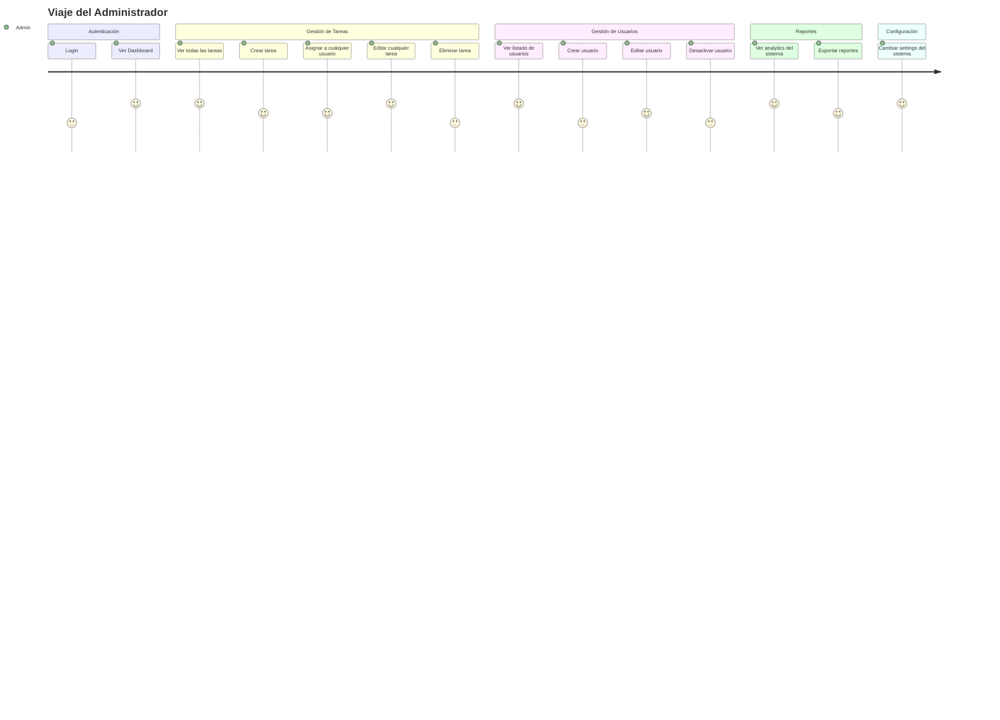
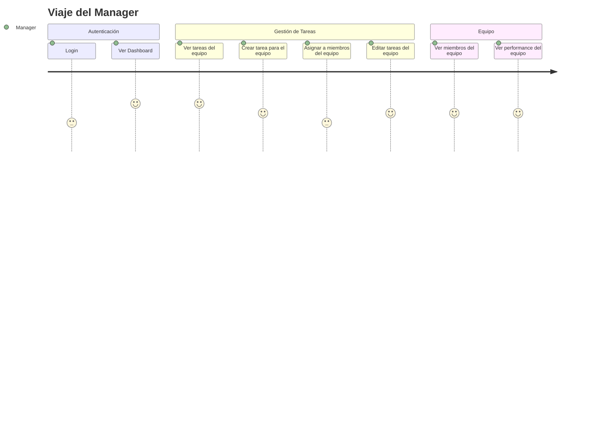
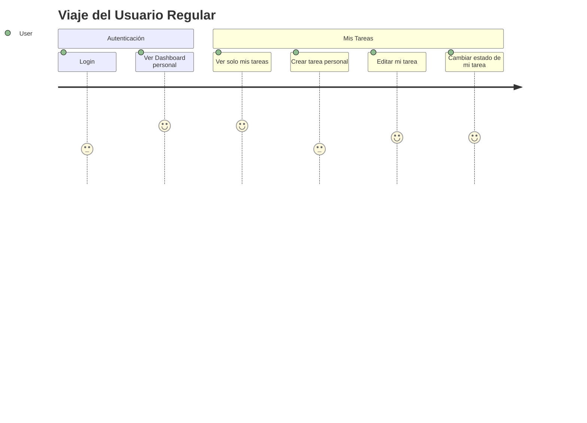
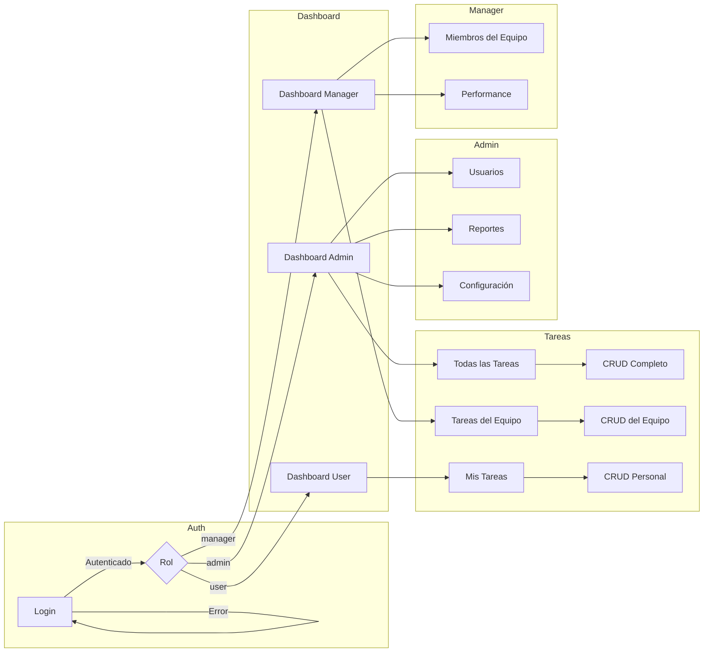

# Mapa de Viaje del Usuario — TaskManager

## Journey: Admin

### Reglas de Negocio para Admin
- Puede ver, crear, editar y eliminar **cualquier** tarea
- CRUD completo de usuarios
- Acceso a reportes globales
- Configuración del sistema

---

## Journey: Manager

### Reglas de Negocio para Manager
- Solo ve tareas de los miembros de **su equipo**
- No puede eliminar tareas
- No puede gestionar usuarios (solo ver miembros)
- No puede acceder a config del sistema

---

## Journey: User

### Reglas de Negocio para User
- Solo ve tareas **asignadas a él** o **creadas por él**
- No puede asignar tareas a otros
- No puede eliminar tareas
- No puede ver usuarios ni reportes

---

## Matriz de Features por Rol

| Feature | Admin | Manager | User |
|---------|-------|---------|------|
| Login | ✅ | ✅ | ✅ |
| Dashboard con widgets | ✅ | ✅ | ✅ |
| Ver todas las tareas | ✅ | ❌ | ❌ |
| Ver tareas del equipo | ✅ | ✅ | ❌ |
| Ver mis tareas | ✅ | ✅ | ✅ |
| Crear tarea | ✅ | ✅ | ✅ |
| Asignar tarea a otros | ✅ | ✅ (solo equipo) | ❌ |
| Editar cualquier tarea | ✅ | ❌ | ❌ |
| Editar tareas del equipo | ✅ | ✅ | ❌ |
| Editar tarea propia | ✅ | ✅ | ✅ |
| Eliminar tarea | ✅ | ❌ | ❌ |
| CRUD Usuarios | ✅ | ❌ | ❌ |
| Ver listado de usuarios | ✅ | ✅ (solo equipo) | ❌ |
| Reportes globales | ✅ | ❌ | ❌ |
| Reportes del equipo | ✅ | ✅ | ❌ |
| Configuración del sistema | ✅ | ❌ | ❌ |

---

## Flujo Transversal del Sistema

---

## Vistas Asociadas por Rol

| Vista | Archivo Mockup | Admin | Manager | User |
|-------|---------------|-------|---------|------|
| Login | `07-mockups/login.html` | ✅ | ✅ | ✅ |
| Dashboard | `07-mockups/dashboard.html` | ✅ | ✅ | ✅ |
| Listado de Tareas | `07-mockups/tasks-list.html` | ✅ (todas) | ✅ (equipo) | ✅ (propias) |
| Formulario de Tarea | `07-mockups/task-form.html` | ✅ | ✅ | ❌ |
| 403 Acceso Denegado | `07-mockups/403.html` | ❌ | ❌ | ❌ |
| 404 No Encontrado | `07-mockups/404.html` | ✅ | ✅ | ✅ |
| 500 Error Interno | `07-mockups/500.html` | ✅ | ✅ | ✅ |
