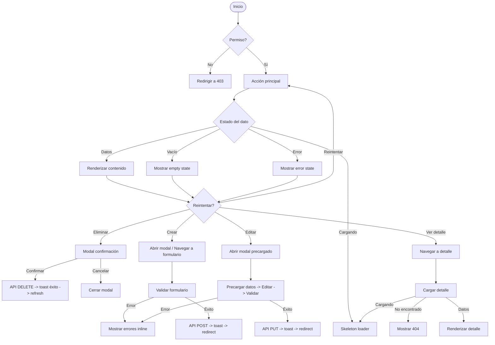
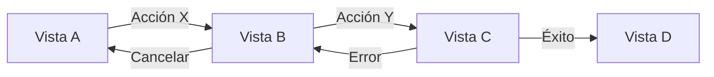

# Flujo: [Nombre del Flujo]

## Descripción
[Descripción general del flujo: qué proceso describe, quién lo ejecuta, cuándo se activa]

## User Stories Relacionadas
| ID | Historia |
|----|----------|
| US-001 | Como [rol] quiero [acción] para [beneficio] |
| US-002 | Como [rol] quiero [acción] para [beneficio] |

---

## Diagrama de Flujo

---

## Vista General

### Actores
| Actor | Descripción |
|-------|-------------|
| [Rol] | [Qué puede hacer en este flujo] |
| [Rol] | [Qué puede hacer en este flujo] |

### Precondiciones
- [Condición 1]
- [Condición 2]

### Postcondiciones
- [Resultado esperado 1]
- [Resultado esperado 2]

---

## Pasos del Flujo Detallados

### Paso 1: [Nombre del paso]
| Campo | Valor |
|-------|-------|
| **Vista** | `[enlace a la vista]` |
| **Acción** | [qué hace el usuario] |
| **Permiso requerido** | [rol(es)] |
| **Validaciones** | [validaciones del sistema] |
| **Respuesta esperada** | [qué debe ocurrir] |
| **Error posible** | [qué puede fallar y cómo se maneja] |

### Paso 2: [Nombre del paso]
...

---

## Mapa de Navegación

---

## Estados de Interfaz por Paso

| Paso | Vista | Estado | Descripción Visual | Comportamiento |
|------|-------|--------|-------------------|----------------|
| 1 | login | loading | Spinner en botón + inputs deshabilitados | Bloquear UI hasta respuesta |
| 1 | login | error | Alert rojo arriba del form | Mantener datos ingresados |
| 2 | dashboard | empty | "No hay tareas aún. Crea tu primera tarea." + botón CTA | Botón lleva a /tasks/create |
| 2 | dashboard | loading | Skeleton de 4 widgets | Animación de shimmer |

---

## Reglas de Negocio

| ID | Regla | Aplica a | Consecuencia si no se cumple |
|----|-------|----------|------------------------------|
| R1 | Un manager solo ve tareas de su equipo | manager | 403 o filtro automático |
| R2 | Un usuario no puede eliminar tareas | user | Botón eliminar oculto / 403 |
| R3 | [Regla adicional] | [rol] | [consecuencia] |

---

## Validación del Flujo

- [ ] Todos los pasos tienen estados (loading, empty, error, success) definidos
- [ ] Cada bifurcación del mermaid tiene una vista o acción correspondiente
- [ ] Los permisos RBAC están correctamente aplicados en cada paso
- [ ] Las reglas de negocio están implementadas en la lógica del flujo
- [ ] Los errores tienen mensajes claros para el usuario y log para debugging
