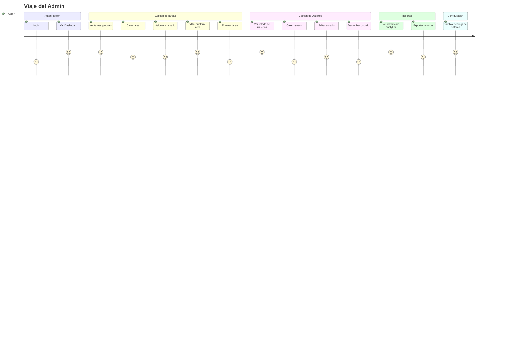
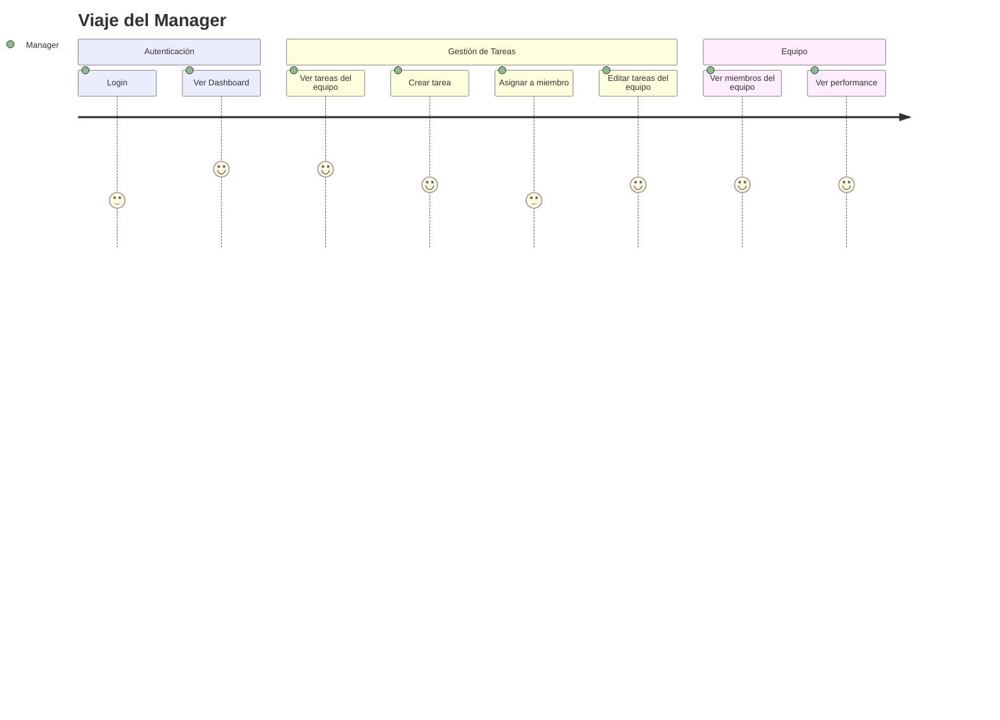
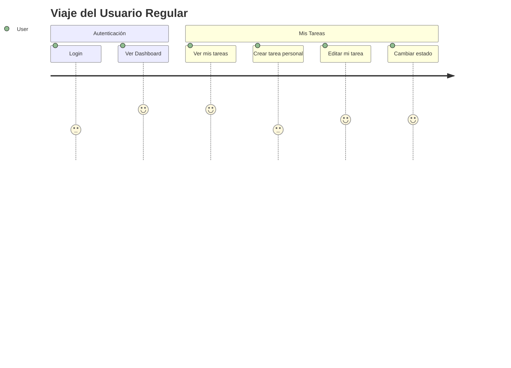
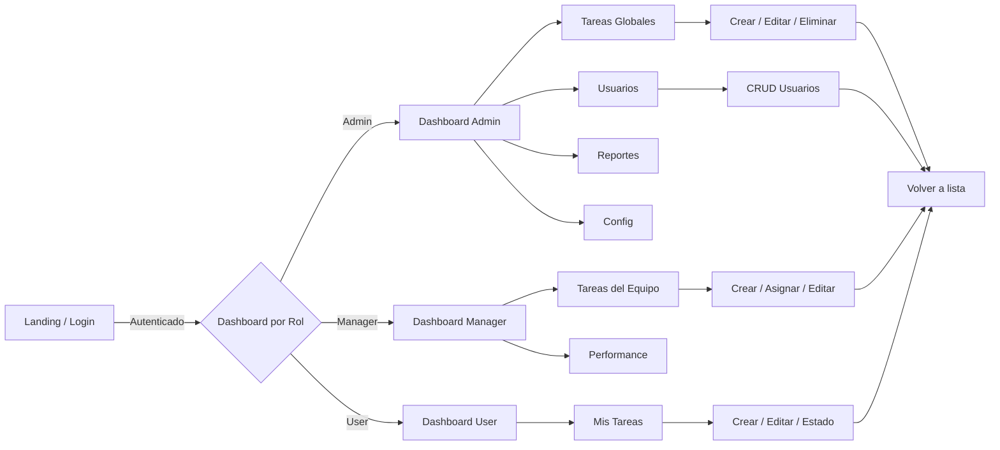

# Mapa de Viaje del Usuario

> Visión general de cómo cada rol interactúa con el sistema de principio a fin.

---

## Journey: Admin

### Puntos de Dolor Potenciales
- [Posible dolor 1]
- [Posible dolor 2]

### Oportunidades de Mejora
- [Oportunidad 1]

---

## Journey: Manager

### Puntos de Dolor Potenciales
- [Posible dolor 1]

---

## Journey: User

### Puntos de Dolor Potenciales
- No puede asignar tareas a otros
- No puede ver tareas del equipo

---

## Matriz de Features por Rol

| Feature | Admin | Manager | User |
|---------|-------|---------|------|
| Login | ✅ | ✅ | ✅ |
| Dashboard | ✅ | ✅ | ✅ |
| Ver todas las tareas | ✅ | ❌ | ❌ |
| Ver tareas del equipo | ✅ | ✅ | ❌ |
| Ver mis tareas | ✅ | ✅ | ✅ |
| Crear tarea | ✅ | ✅ | ✅ |
| Asignar tarea | ✅ | ✅ (equipo) | ❌ |
| Editar cualquier tarea | ✅ | ❌ | ❌ |
| Editar tareas del equipo | ✅ | ✅ | ❌ |
| Editar tarea propia | ✅ | ✅ | ✅ |
| Eliminar tarea | ✅ | ❌ | ❌ |
| CRUD Usuarios | ✅ | ❌ | ❌ |
| Reportes | ✅ | ✅ (equipo) | ❌ |
| Configuración | ✅ | ❌ | ❌ |

---

## Flujo Transversal del Sistema

---

## Vistas Asociadas

| Vista | Rol(es) | Flujo relacionado |
|-------|---------|-------------------|
| [vista] | [rol] | [flujo] |
| [vista] | [rol] | [flujo] |
