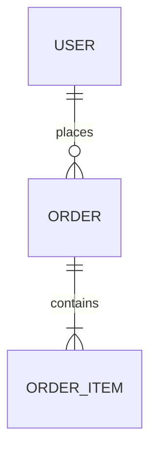

# Sub-Plantilla: Esquema de Base de Datos y Modelo de Datos

---

## 1. Decisiones de Modelado

- ¿Por qué esta base de datos y no otra?
- Estrategia de normalización
- Uso de soft deletes / auditoría
- Polimorfismo o herencia en el modelo
- Polyglot persistence (si aplica)

## 2. Diagrama ER

## 3. Esquema Detallado

### Tabla: users

| Columna | Tipo | Restricciones | Notas |
|---------|------|---------------|-------|
| id | uuid | PK | |
| email | varchar(255) | UNIQUE, NOT NULL | |
| ... | | | |

(Repetir para cada tabla / colección)

## 4. Índices Recomendados

- 

## 5. Reglas de Acceso y Privacidad

- 

**Entregable**: `03-Esquema-Base-de-Datos.md` + diagrama Mermaid o imagen.
